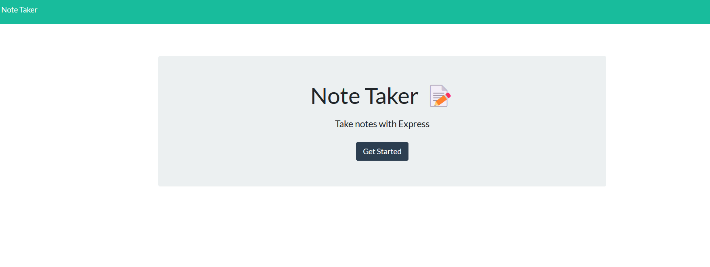
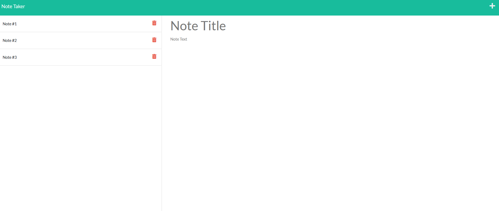

<h1 align="center">Note Taker</h1>

## Description
This Note Taker application can be used to write and save notes. Express.js is used for the back end so that the application can save and return older & current notes.

## Technologies
* CSS
* HTML
* JavaScript
* Node.js
* NPM
* Express

## Table of Contents

- [Installation](#installation)
- [Usage](#usage)
- [Screenshot](#screenshot)
- [License](#license)

## User Story
AS A small business owner 
I WANT to be able to write and save notes 
SO THAT I can organize my thoughts and keep track of tasks I need to complete

## Acceptance Criteria
GIVEN a note-taking application 
WHEN I open the Note Taker 
THEN I am presented with a landing page with a link to a notes page 
WHEN I click on the link to the notes page 
THEN I am presented with a page with existing notes listed in the left-hand column, plus empty fields to enter a new note title and the note’s text in the right-hand column 
WHEN I enter a new note title and the note’s text 
THEN a Save icon appears in the navigation at the top of the page 
WHEN I click on the Save icon 
THEN the new note I have entered is saved and appears in the left-hand column with the other existing notes 
WHEN I click on an existing note in the list in the left-hand column 
THEN that note appears in the right-hand column 
WHEN I click on the Write icon in the navigation at the top of the page 
THEN I am presented with empty fields to enter a new note title and the note’s text in the right-hand column
## Installation
First clone this repository & run "npm i" to your computer. Once installed, type "node server.js" in the terminal. You can find the application on localhost:3001. To stop the server, hold control button + C button.

## Usage
Live link [here](https://radiant-chamber-54860.herokuapp.com)

## Screenshots

## License
 
This project is licensed under the MIT License - see the [license info](https://opensource.org/licenses/MIT) for more details.

